B7094 is a Windows-based emulator for the IBM 7094 mainframe computer from the 1960s.

## Basic usage

If you're a "casual" user, and running Windows, just:

- Download the B7094V34A.zip distribution archive

- Extract it into a new folder

- Run either B7094.32.exe or B7094.64.exe in the created "Bin" sub-folder

- Click on the options displayed to select from the many demonstrations available.

B7094 makes no changes to the Windows registry or any other part of the system other than its install folder. Deleting the distribution archive and the install folder will completely remove B7094 from your system.

There is a YouTube video [here](https://www.youtube.com/watch?v=4xaBS6pWrG0) that shows the use and operation of B7094 (an earlier release, but the basic operation is the same).

There is also more documentation in the "Docs" sub-folder of the install folder, in the following files:

- **B7094SourceReadMe.txt** lists the source files in the ..\Build\Source sub-folder of the install folder. Describes each window file in some detail, making it something of a "user's manual". Describes how to install and configure Lazarus/Free Pascal and rebuild the B7094 executables.

- **B7094ScripterSyntax.txt** describes in detail the command syntax of the EC7 script language.

- **B7094SuggestedManuals.txt** gives links to some useful manuals on bitsavers and elsewhere.

- **B7094DebuggingExamples.txt** gives a couple of simple illustrations of how the facililties in B7094 can be used to perform some (admittedly rudimentary) debugging of programs running on the emulated machine.

- **B7094ReadMe.txt** is similar to the information in this section of the GitHub README.

- **B7094WhatsNew.txt** describes the current status and history of the emulator (including its very earliest history).

## Additional details

This emulator has a graphical interface with separate windows for the main console with all its flashing lights, the card reader, the line printer and all the tape drives, as well as several other specialized windows. The console is not, alas, a faithful recreation of an IBM 7094 in photo-realistic detail; it's a schematic representation modelled loosely on the console of an [IBM 7044](https://www.gettyimages.com/detail/news-photo/woman-at-a-design-model-of-the-operators-console-of-the-new-news-photo/107644558).  If you want photo-realism, check out Roberto Sancho Villa's work [here](https://github.com/rsanchovilla/SimH_cpanel).

B7094 can run two different preserved versions of the IBSYS operating system, and can compile and execute programs written in FORTRAN II and the Fortran Assembly Program (FAP) under the FORTRAN II subsystem; as well as FORTRAN IV, COBOL, and a Macro Assembly Program (MAP) under the IBJOB subsystem.  All the required IBM 7094 software to do that is included in the distribution.

The source of B7094 is included in the distribution, to allow you to modify or enhance the program and rebuild it. You'll need to install Lazarus/Free Pascal to do this, the 32-bit and/or 64-bit versions. The current B7094 v3.4A release was built using the newest (as of September 2023) releases of these development tools (Lazarus 2.2.6, 05 March 2023; Free Pascal 3.2.2, 20 May 2021).

There is another YouTube video [here](https://www.youtube.com/watch?v=W5Blz5-chSU) that shows how to compile B7094 from the sources.

The 32-bit executable will still run on Windows XP, and both executables will run on any 64-bit version of Windows from Vista up through the present. There are Windows dependencies "baked in" to the code, but the program can be run on Linux using Wine (with a few non-fatal quirks), and even under Wine 8.x on x86 MacOS (the 64-bit executable has been tested on 'Catalina' in a VM). The B7094V34A.tgz archive is provided solely for the convenience of the Linux user; its contents are the same as B7094V34A.zip.

The second set of archives here (labelled "reloc_scripts_*") are packages containing bash shell scripts and other supporting utilities (hence requiring a Unix-y environment to run, either Linux or something like Msys2 or Cygwin under Windows) that can process Peripheral Punch tapes generated by the IBSYS compilers and extract and format the data required to create relocatable binary jobs (i.e., programs that can be re-run without recompiling them every time).  There are instructions on how to do this in the included README.txt file.  But note that these are provided for **advanced** users.  The relocatable jobs in the demo scripts have already been processed with these tools.

## Changes since the last (v3.3B) release

B7094 is now hosted at GitHub; the earlier release was hosted at FossHub.

This new version fixes some long-standing bugs in the user interface:

- The Editor is more useful than before; you can now 'Save' and 'SaveAs' files in addition to just 'Open'-ing and 'Run'-ning them. It is also possible to just type script commands into a 'New' Editor window and 'Run' them immediately, without having to explicitly save the file.

  This is not new, but it's worth pointing out here: if you're running the demo suite and at any point you click the 'End Demonstration Script' on a Scripter window, you can of course restart the demo suite by powering off the emulator and restarting it. But you can also, after having ended the demo, simply click the 'Editor' button on the Control Panel window to display the Text Editor window, click the 'Open' button on the Text Editor, navigate to the ..\Files\Scripts directory in the Open File dialog, select 'B7Demo.EC7' and click 'Open'. Then click 'Run' in the Text Editor to restart the demo suite. You could also 'Open' and 'Run' any other *.EC7 script (such as one of the "Xample_xxx.EC7' scripts in the same directory).

  **Note:** the Text Editor will "remember" that a file is open even after the emulator is powered off (the information is saved in the ..\Bin\B7094.INI file). If you want the Text Editor to "forget" a file, you have to explicitly 'Close' it.

- The Stops and Core View windows are now fully functional, which provides some rudimentary debugging capabilities for programs being run on the emulated machine.

There are also some new capabilities in the emulation itself:

- The scripted demos have been expanded to allow choosing between two alternative versions of IBSYS: the originally-included two-tape ASYS1/ASYS8 system recovered by Paul Pierce a quarter-century ago, and the single-tape "Aerojet-General" KSYS61 version (also originally recovered by Paul Pierce).

- Using the KSYS61 system, FORTRAN II now supports "chaining", which allows the early-60s "Structural Engineering System Solver" program (STRESS III, from MIT, originally transcribed from a listing on bitsavers by Richard Cornwell and later further proofread by others), to build and run to completion with sample input data from the STRESS user's manual downloadable from MIT.

- Sample programs can now be run in relocatable binary form (for FORTRAN II, in KSYS61 only; for IBJOB languages, in either version of IBSYS). Instructions (and Unix-y utilities) for extracting a binary job from the "Peripheral Punch" tape generated by the compiler, are provided in the separate "reloc_scripts_*" archives. The "reloc_scripts_Msys2.zip" archive is specifically targeted for the Msys2 environment on Windows. The "reloc_scripts_Linux.tgz" archive is targeted for Linux, or for Cygwin on Windows. The bash scripts in the former contain DOS-style (CRLF) line endings, while those in the latter contain Unix-style line endings. Additionally, the contents of "reloc_scripts_Msys2.zip" are ready-to-use "out of the box", whereas "reloc_scripts_Linux.tgz" requires first running a script to rebuild a couple of "helper" utilities. See the included README.txt file for more information.

- The emulator demo scripts can be run either in "verbose" mode, which provides lots of explanation and references; or "silent" mode, which skips all the verbiage and just presents straightforward option menus on the minimum number of click-through screens.

- The demos have been reorganized into more logical groups by "subsystem" -- either FORTRAN II (which provides FORTRAN II and the Fortran Assembly Program) or IBJOB (which provides FORTRAN IV, COBOL, and a Macro Assembly Program).  A couple of the utility demos from the earlier release have been retained: the IBEDT editor used to maintain IBSYS itself (in the demo, used just to copy and list the contents of a system tape), and the IBJOB "Librarian" used to maintain the IBLIB subroutine library (here just used to list and cross-reference the contents of the library).  A couple of stand-alone diagnostic programs -- one loaded from the card reader the other from tape -- are still included (and both can now run error-free).

- A number of new script commands have been added to support the creation of card deck and tape images for relocatable binary jobs.

- Since it doesn't really make any sense to display register and memory values using hexadecimal representations for a 36-bit machine using 6-bit bytes (whereas it makes perfect sense to do so for a machine whose registers are multiples of 8-bit bytes, such as the IBM System/360 and nearly all modern machines), the Oct/Hex toggle buttons previously present on the Console, Reader, and CoreView windows have been eliminated.

B7094 does not support the range of peripherals (and pass the array of diagnostics) that Rich Cornwell's SimH-based i7090 does; neither does it support the spectacular photo-realistic panels created by Roberto Sancho Villa. And it can't run CTSS.  But B7094's graphical interface still provides some visual entertainment, and it's possibly easier than the more sophisticated emulators for a newcomer to get started with, while still providing some significant capabilities.

## About the "Tape Viewer"

The Tape Viewer has been thoroughly re-worked:

- The hexadecimal column in the binary-mode display (that previously showed the P7B formatting of a tape image) has been eliminated, and replaced by a new character column showing machine words interpreted as if they contain six characters using internal BCD character codes, rather than the usual external (or "alternate") BCD character codes used on a BCD tape. This column always contains gibberish for a "pure" BCD tape, but on a hybrid BCD and binary tape (such as a job tape containing a program in relocatable binary form), or even on a "pure" binary tape (such as an IBSYS tape), this column sometimes shows human-readable text that can be of interest.

- There is now a "sliding window" in the Tape Viewer, where arbitrary "From Byte" and "To Byte" positions can be selected for display. The "Redisplay" button causes the chosen limits to take effect (if "From Byte" is blank, it defaults to 0; if "To Byte" is blank, it defaults to either the last position on the tape or to "From Byte" plus a maximum window size, whichever is lower). "Clear" clears "From Byte" and "To Byte". "Use Whole Tape" resets the limits from 0 up to either the actual size of the tape or the maximum window size, whichever is lower. The maximum window size is large enough to be able to see all of ..\Output\SysOut.BCD for 
all the demos without the user having to increase the "From Byte" and click "Redisplay" to see the end of the tape. All the labels and buttons having to do with the adjustable view window are colored purple, to visually group them together.  The Tape Viewer resynchronizes the word framing when starting the display from an arbitrary point on the tape.

## Additional advanced details

A scripting language (in files with extension .EC7 -- "Execute Commands for the B7094") serves to configure the emulator, load IBSYS, and submit programs (in a job stream including the necessary IBSYS control cards) via the emulated card reader or a designated tape drive. These scripts serve the same function as the "do_ibsys.txt" and ".job" files used by the SimH-based i7090 and i7094, but they do not require typing a command line.  The canned demos in the Scripts directory are implemented by means of the EC7 scripting language (and utilize script commands to display text, display option menus, advance to and return from a succession of screens, and call EC7 subroutines defined in the same script file). However, a user can run their own programs by embedding them (by means of an Include command) in a suitable EC7 file, which can then be opened and run from the built-in Editor.  Some simple, in-line "Xample_xxx.EC7" files are provided as templates for doing this.  More sophisticated jobs (such as running relocatable binaries) can be constructed by examining the demo scripts (and utilizing the tools provided in a "reloc_scripts_*" archive).

Like Rich Cornwell's SimH-based i7090, B7094 expects to "see" the correct parity on tapes (odd for binary records, even for BCD ones). This is in fact necessary to be able to run relocatable binary jobs in FORTRAN II (with the KSYS61 version of IBSYS only). Tapes created on other emulators can be used with B7094 provided they are:

- in P7B format (originated by Paul Pierce: this is the default with Dave Pitt's s709, with SimH format being optional; while Rich Cornwell's i7090 and Bob Supnik's i7094 are the other way around, with SimH format the default, but P7B available as an option),

- have the correct parity (i7090 creates tapes with correct parity, and I believe i7094 and s709 do as well, and 3) use the "alternate" BCD coding for BCD records (the default for i7090 and i7094, optional for s709).

Likewise, tapes created by B7094 can be used on other emulators (whether or not the other emulators expect to "see" parity; i7090 does, I believe i7094 and s709 do not), if those emulators can:

- utilize tapes in P7B format tapes, either by default (s709) or optionally (i7090, i7094), 

- interpret BCD records using "alternate" coding (i7090 and i7094 do this by default; s709 can optionally do so).

B7094's "Tape Viewer" is a useful tool for examining the contents of any P7B tape: a small script can be created and run in the Editor to mount the tape; then clicking on the tape in the Tape Drives window will bring it up in the Tape Viewer. But here's another way to do it with just the mouse:

(1) Start the emulator, and in the first demo window click 'End Demonstration Script'.

(2) In the Control Panel window, click the 'TapeDrives' checkbox. The Tape Drives window will appear, but not show any configured Tape Units.

(3) On the Tape Drives window, click the 'Add Drive' button. Tape Unit 'A1' will appear, and the 'Show All' radiobutton will be automatically selected. (Continuing to click 'Add Drive' would configure additional Tape Units in the sequence A1,A2,...,A0,B1,B2,...,B0. 'Drop All Drives' deletes all configured drives. 'Drop' deletes the drive shown in the text box to the right of the button. A drive's "CUU" [channel-letter+decimal-unit-number] can be typed into the box [case insensitive, nonsense is rejected]; or the mouse can be dragged across any part of a displayed Tape Unit to populate the 'Drop' box with that unit's CUU.)

(4) On one of the added Tape Units, click the 'Opn' button and browse to any tape image file in the Open Dialog window. Any P7B file can be attached to the drive -- a ..\Output\SysIn.BCD or ..\Output\SysOut.BCD from a previous run (from the ..\Output directory), or any other tape. ('Clo' [close] will detach a tape image file if there's one attached. 'Rew' [rewind] is only likely to be used when re-running a stand-alone tape program [such as 9M71B.BIN] manually. 'PRO' [protect] switches write-protection on and off for a drive. **Note:** You can have a tape image file open and attached to only one drive at a time. If you open the same tape image file in a second drive, that file will be closed and detached from the first drive automatically.)

(5) Now click on the channel-letter+decimal-unit-number of the Tape Unit with your attached tape image file. The Tape Viewer window will appear, displaying the tape in whatever mode matches the image file extension (BCD mode for *.BCD, Binary mode for any other extension). (If you 'CLO'se and detach a tape unit's file, or drop the tape unit altogether, the Tape Viewer will be informed of that and will close automatically.)

You can attach any file, with any name, to a tape drive -- either via a Tape Unit's 'Opn' button or via an EC7 script's 'Mount' command. But any file you expect to be usable with IBSYS must have a filename extension of either '.BCD' or '.BIN' (upper- or lower-case, doesn't matter). This is true even if the file is otherwise a properly-formatted P7B image containing "real" data. Further, any file intended for use with IBSYS that contains BCD records (with even parity), or **begins** with BCD records in the case of a "hybrid" tape (such as a job input tape) must have the '.BCD' extension. And a file which contains binary records (with odd parity), such as an operating system or stand-alone diagnostic tape, must have the '.BIN' extension.

You can also save the text in the Tape Viewer window by clicking the 'Save' button at the top left of the window. There won't be any acknowledgment of the button press, but you'll get a "dump" file in the ..\Output directory with the extension '.DMP', named according to the tape image file that was being displayed (e.g., 'SYSOUT.BCD.DMP' or 'SYSIN.BCD.DMP').  The dump file name will always reflect the format (and hence the extension) of the tape image that was being displayed in the Tape Viewer (either '.BCD' or '.BIN') but in fact the text in the Tape Viewer window will be saved in whatever mode the Tape Viewer is currently displaying: either 'BCD' or 'Binary'.

## Writing and running your own programs

The EC7 script files comprising B7094's demo suite are a **bit** convoluted at first glance; so a number of simple, in-line script files (named ..\Files\Scripts\Xample_xxx.EC7) are provided as templates for anybody who actually wants to write and run IBM 7090/7094 programs in any of the supported languages (FORTRAN II, FAP; FORTRAN IV, COBOL, MAP). These "Xample" scripts should make it possible to just concentrate on your own program and not have to worry about the "envelope" of IBSYS control cards or EC7 configuration commands. You can basically just copy one of the Xample scripts and make a few very small alterations to have it run your own code.

To start, here's the procedure for **running** one of the Xample scripts. We'll exhibit one that assembles and runs a very short FAP assembly-language program, under IBSYS's FORTRAN II subsystem, to request IBSYS to generate a core dump.

(1) Start the emulator, and in the first demo window click 'End Demonstration Script'.

(2) In the Control Panel window, click the 'Editor' button (or the 'Editor' checkbox, they do the same thing). The Text Editor window will appear. It'll likely be blank, but if it's not, click the 'Close' button and close any editing sessions that might currently be open.

(3) Click the 'Open' button, and navigate to ..\Files\Scripts and open the file "Xample_Sysdmp.Fap.KSYS.EC7" (there's also an ASYS version of this file, but we're sticking with the KSYS version for reasons that will explained below).

(4) Now just click the 'Run' button on the Editor window, and the job will run. You could then 'Close' the file in the Editor, if you want; otherwise it will be kept open even if you 'Power Off' and restart the emulator. (Editor sessions are saved in the ..\Bin\B7094.INI file in the [EditFiles] section.)  But don't close the example script file just yet.

Scroll down a bit in the Editor, past the mounting of all the SCRATCH tape drives, and you'll see a line:

####
    Include File='Sysdmp.Fap'    // Insert the source text

"Sysdmp.Fap" (in ..\Files\Cards) is the actual Fortran Assembly Program code:

####
    *     FAP                                                               SYSDMP00
    *      FORCE IBSYS TO DUMP CORE                                         SYSDMP01
    *      SEE IBM 7090/7094 IBSYS OPERATING SYSTEM VERSION 13 MANUAL       SYSDMP02
    *      C28-6248-7 DEC. 1966                                             SYSDMP03
    *      SYSTEM CORE-STORAGE DUMP PROGRAM, P. 18                          SYSDMP04
           COUNT   14                                                       SYSDMP05
    *      SST IS A PSEUDO-OPERATION THAT LOADS THE SYSTEM SYMBOL TABLE     SYSDMP06
    *      IT MAKES THE LOCATION OF SYSDMP (115 OCTAL) AVAILABLE HERE       SYSDMP07
    *      SEE IBM 7090/7094 FORTRAN II ASSEMBLY PROGRAM (FAP) MANUAL       SYSDMP08
    *      GC28-6235-5 APRIL 1965                                           SYSDMP09
    *      APPENDIX C: SYSTEM SYMBOL TABLE, FORTRAN MONITOR, P. 69          SYSDMP10
           SST                                                              SYSDMP11
           TRA     SYSDMP                                                   SYSDMP12
           END                                                              SYSDMP13

Note that the "Include File=" command in the script is surrounded by text constituting the IBSYS and FORTRAN control cards that precede and follow the actual user-program source code. Without the single quotes required by the EC7 script interpreter, the first cards in the "job deck" would look like:

####
    $LIST
    $DATE          091423
    $UNITS
    $JOB           SYSDMP
    $EXECUTE       FORTRAN
    *     ID       SYSDMP
    *     XEQ
    
The cards beginning with '$' are IBSYS control cards; note that any "argument" on such a card must begin in column 16. All the IBSYS control cards are documented in the "IBM 7090/7094 IBSYS Operating System Version 13 Operator's Guide", section "Control Cards", p. 12, at bitsavers.org/pdf/ibm/7090/C28-6355-4_7090oper_Jun65.pdf ; as well as the "IBM 7090/7094 IBSYS Operating System Version 13 System Monitor (IBSYS)" manual, section "System Supervisor", p. 10, at bitsavers.org/pdf/ibm/7090/C28-6248-7_v13_IBSYS_Dec66.pdf .

$LIST causes **all** control cards to be listed on the lineprinter as well as the System Output Unit (SYSOU1 -- in this example, tape drive A3, with mounted tape image file ..\Output\SysOut.BCD). Normally, only a subset of control cards is also listed on the lineprinter.

$DATE sets the system date (the argument is "plugged in" to the card by the scripter's '&DATE' macro).

$UNITS causes all the "System Unit function names" to be listed on the output tape (and in our case the lineprinter as well). These are symbolic names for various functions served (mainly, and exclusively in our case apart from the card reader) by tape drives. SYSIN1 (or SYSIN2) means "system input"; SYSOU1 (or SYSOU2) means "system output" (think stdin and stdout in a Unix system); SYSPP1 (or SYSPP2) means "peripheral punch" (mainly for object code, to be punched on cards offline on another computer); SYSUT1, SYSUT2, ..., SYSUT9 ("system utility") are essentially "temp files" used for various things by various programs; etc.; SYSLB1, SYSLB2, ... ("system library") are the "operating system" files. Each System Unit in use has to be associated with a physical tape drive, designated by its "channel letter" and (decimal) "unit number": A1, A2, ..., A0 ("A0" comes at the end because you should think of it as being "A10"); B1, B2, ..., B0.  (A 7094 system could have up to 8 channels, designated by A, B, C, ..., H; we don't ever have to deal with more than 2 (A and B).  The $UNITS control card is not **required** here; it's just there to document what's going on. It's present in all the demo jobs (and in the case of the ASYS demos, it shows the list before and after System Unit reassignments via the "$ATTACH . . .", "$AS . . ." control cards -- refer to the IBM manual). One other physical device specification you'll see in the scripts, in addition to the physical tape drive designations, is "RDA" -- "card reader on channel A", which also has the System Unit function name "SYSCRD".

The $JOB card marks the beginning of a "job" -- a unit of work in IBSYS. It must always be present.

The $EXECUTE card causes IBSYS to invoke one of its major "subsystems" -- in this case, the FORTRAN Processor. (The IBJOB Processor is also invoked by means of the $EXECUTE card.)

The cards beginning with '*' are FORTRAN processor control cards, and the FORTRAN control-card commands must begin in column 7. All the FORTRAN Processor control cards are documented in the "IBM 7090/7094 Programming Systems FORTRAN II Programming" manual, Chapter 14 "FORTRAN II Monitor Control Cards", p. 37, at bitsavers.org/pdf/ibm/7090/C28-6054-5_FORTRANII_Apr64.pdf ; as well as the "IBM 7090/7094 Programming Systems FORTRAN II Operations" manual, Chapter 13 "FORTRAN II Monitor Control Cards and Utility Cards", p. 30, at bitsavers.org/pdf/ibm/7090/C28-6066-6_FORTRANII_oper.pdf .

The 'XEQ' control card is supposed to mean "execute immediately" rather than "just compile or assemble, but do not execute", but our two IBSYS versions' FORTRAN processors are idiosyncratic with regard to "honoring" this -- ASYS respects the absence of an XEQ card; KSYS does **not**, and will go ahead with immediate execution whether or not it's there. Of course, in all cases, attempting to execute the program is denied if there are errors reported by the compiler or assembler ("EXECUTION DELETED" is the usual message).

The cards following the inserted source code are:

####
    ~
    $IBSYS
    $STOP

The '~' character is just our convention to represent an End-Of-File card. '$IBSYS' tells the FORTRAN processor to return control to the IBSYS monitor. '$STOP' tells the system to print some final statistics and halt the CPU.

Strictly speaking, the first "card" in ..\Files\Cards\Sysdmp.Fap is actually a FORTRAN Processor control card, not part of the assembly-language source and **certainly** not a comment -- note that the 'F' in "FAP" is aligned with column 7; the rest of the lines beginning with asterisks **are** comments. The first actual comment is used by the Assembler as the text of page headings on the SYSOU1 tape. In a similar example script that could have been shown here, ..\Files\Scripts\Xample_MatrixInv05.Ftn.KSYS.EC7 , the file inserted by the 'Include File=' command, ..\Files\Cards\MatrixInvO5.Ftn , **does** contain "pure" FORTRAN II source code (and the initial line of that is also a comment whose text is used for page headings in the compiler report). But the core dump demo is more entertaining.

It's a file-naming convention in the ..\Files\Cards directory that source "decks" with ".Ftn" in the file names contain FORTRAN II source code, whereas decks with ".For" in the names contain IBJOB/FORTRAN IV ("IBFTC") source code. And of course ".Cob" indicates IBJOB/COBOL ("IBCBC").

There's no demo source file that's pure IBJOB/MAP ("IBMAP") Macro Assembly Program source code, but the source file for one of the demo jobs -- ..\Files\Cards\Lsqrs.For -- is a very large deck with multiple "Control Sections" (as they're called in the native lingo of this machine), and some of them are MAP subroutines. The multiple sections in this source file also necessitate the embedding of some IBJOB control cards ($IBFTC, $IBMAP) in that particular file. (All the IBJOB control cards are documented in the "IBM 7090/7094 IBSYS Operating System Version 13 IBJOB Processor" manual, section "IBJOB Processor Control Cards", p. 8, at bitsavers.org/pdf/ibm/7090/C28-6389-1_v13_IBJOB_Jun65.pdf .) Similarly, ..\Files\Cards\StressIII.Ftn is a large multi-section file with embedded FORTRAN control cards.

If no path is given, the scripter's "Include File=" command will find the file of that name in the ..\Files\Cards directory. This is the default directory where B7094 keeps source-code "decks" for all the included demo programs. This is true even if, as is the case here, the program and its enclosing control cards must be converted to a tape before the job can run (which is required here because the FORTRAN II subsystem does not permit job input from cards. This conversion occurs slightly further on in the "Xample_Sysdmp.Fap.KSYS.EC7" script file you currently have open in the Editor.) The ..\Files\Tapes directory is where the IBSYS tapes live, in addition to some other binary files that are used to create relocatable binary jobs for input on tape. Most of the files in ..\Files\Cards are text files -- either source code or input data for a demo program -- though there are also some binary files in that directory, used to create relocatable binary jobs for input via the card reader.

There are two alternatives if you want to keep your own files elsewhere than in the expected directories: a) use the full path name in the "Include File" command or b) add to or change the list of default search paths on the B7094 "Configuration" window (click the "Config" checkbox on the Control Panel to bring it up). You might in fact want to create ..\Files\MyScripts and ..\Files\MyCards directories underneath your B7094 installation directory, and add these directories to the list of search paths on the Configuration window.

The ..\Output directory is something of a scrapheap. It contains files built by the scripter (e.g., SysIn.BCD), files created during execution of a program (e.g., SysOut.BCD), SCRATCH.*.BIN files created during system setup, .lst files created when a script explicitly saves the lineprinter as a named file, a "B716.PRN" file -- that's the default name for the lineprinter output when it wasn't saved as a named file (a named .lst file is created as soon as a demo finishes; the .PRN file doesn't appear until the emulator is powered off), various bits and pieces used during the assembly of a relocatable binary job (reloc.bin, RelocHeader.BIN, RelocTrailer.BIN), trace (.TRC) files, Tape Viewer dump (.DMP) files. In general, it's safe to delete the contents of ..\Output, unless there's something you explicitly wanted to keep (such as a .TRC or a .DMP).

There is one file in the ..\Output directory that's included in the distribution: ..\Output\B7.BCD . The two last jobs on all the COBOL demo screens are 'Run a program to copy cards to tape' and 'Run a program to copy the previously-generated tape to the printer' (or their corresponding 'Compile and run...' variants). ..\Output\B7.BCD is the tape image file that "bridges" those pairs of COBOL demos. (That's true for both the ASYS and KSYS demos, although in both cases it entails reassignment of SYSUT3 to B7 from a different initial default as part of the job. The COBOL source code "wants" SYSUT3.). ..\Output\B7.BCD is kept around so that the proverbial "naive user" doesn't try to run the job that copies the tape before the tape has been created, and is flummoxed (or worse) by the blood-red "I/O operation Error" window and message "No such input file:..." that would appear in that case.  That wouldn't be a disaster, but it might be rather a shock. (If this ever happens, any EC7 script you've been running will be terminated. You could, of course, at that point 'Power Off' and restart the emulator; but you could also bring up the Editor, browse to ..\Files\Scripts\B7Demo.EC7 -- or any other script -- and restart the scripter.)

So the bottom line here is: you could copy"Xample_Sysdmp.Fap.KSYS.EC7" and only have to change a single line -- the "Include File=..." -- to run your own FORTRAN II or FAP program (although maybe you'd also want to change the name on the $JOB card and the name on the FORTRAN 'ID' card -- but that's up to you). Alternatively, you could copy one of the other Xample scripts, say ..\Files\Scripts\Xample_Primes.For.EC7 or ..\Files\Scripts\Xample_Primes.Cob.EC7 , and make fairly minimal changes to be able to use one of the IBJOB languages (FORTRAN IV or COBOL, in those scripts).

**Note:** it's mentioned above that KSYS (the Aerojet-General KSYS61.BIN single-tape version of IBSYS) is slightly easier to work with than the ASYS1.BIN/ASYS8.BIN two-tape version of IBSYS. The reason is somewhat obscure. The ASYS1/ASYS8 duo included with B7094 are the **original** images of the tapes recovered by Paul Pierce in the late 90s. But this system has a quirk: it was built by default with System Units SYSIN1 and SYSOU1 pointing to the same tape drive (B1). This is not a problem when jobs are coming from the card reader (via the Sense Switch 1 "on" setting), but if a job has to come from tape (as with FORTRAN II), it requires a bit of fancy footwork to switch the SYSOU1 System Unit assignment so the SYSIN1 tape doesn't get clobbered as soon as a job starts to run (it was a bit surprising to discover that this was possible at all). The EC7 scripts included here **do** perform that little dance, but it adds an additional layer of obscurity to everything else that's going on. The other emulators (i7090, i7094, s709) seem to be using (in their provided software kits) a rebuilt version of the ASYS1 system (presumably created from IBSYS source with Dave Pitt's "asm7090" and "lnk7090" cross-assembler and cross-linker) that eliminated this problem (and also only requires a single channel's-worth of tape drives).

There's one other amusing bit of trivia about the original Paul Pierce version of ASYS1.BIN (which is still available at piercefuller.com/oldibm/709x/tape/asys1.html ).  This tape is slightly imperfect -- it contains two "short words" (words containing only 5 6-bit bytes instead of the expected 6), both of which occur at the end of a record. The first short word is at byte offset (from 0) 299666, and is at the end of (counting from 1) Record 1 of File 3 (this record is IBFTCE -- part of the FORTRAN IV compiler). The second short word is at byte offset (from 0) 967608, and is at the end of (counting from 1) Record 5 of File 8 (this record is 9F1700 -- part of FORTRAN II). You can see these short words for yourself in B7094's Tape Viewer, if you have the patience to wait for the tape to be loaded into it. Now, B7094 can detect short words and pad them out with 0 bytes, which happens to be correct here (both words are '500000000000' octal, which is how most records end on this tape). But a few years ago, when I tried this original ASYS1.BIN tape with one of the SimH-based emulators (I won't say which one), and ran the FORTRAN IV "Sieve of Eratosthenes" prime-number demo, I got to see my first-ever 1960s core dump: immediately following the "$EXECUTE IBJOB" control card I got the message on the lineprinter "SYSTEMS CORE DUMP TAKEN AT THIS POINT". Interestingly, it's possible to generate a "repaired" version of this tape, on B7094, just by running $IBEDT to copy SYSLB1 (this is in fact one of the included demos).  The copied tape will then work fine on the other emulators.

The methods described above will take care of compile-and-go (or assemble-and-go) jobs, which will probably be sufficient for the vast majority of users.  It is possible, though, to compile a program from source and then create and submit a relocatable binary version of the program whenever it needs to be re-run.  This is, however, as the Emerald City cabbie said to Dorothy, "a horse of a different color".  See the README.txt file included with the reloc_scripts.* archives for more details about that.

## The Editor and the Scripter

B7094's main "driver" is a command interpreter called the Scripter, which parses and executes a custom interpreted language called EC7 ("Execute Commands for the B7094"). As shown above with the files ..\Files\Scripts\Xample_xxx.EC7 , in order to "point" B7094 at a script and start it running you need to use the Editor (either that, or select the script as the default to run when B7094 starts up -- click the Config checkbox on the Control Panel to see about that).

You can think of the Editor as a more primitive version of Notepad.  You can load files into it (any files, not just EC7 scripts), edit them with the mouse and keyboard, and save them anywhere. You've got select, cut, copy and paste via the mouse (as with Notepad); but no search and replace, formatting, etc.

So to use the Editor to create and run an EC7 script, start B7094 and in the first demo window click 'End Demonstration Script'.  By the way, if you've had enough of the demos and want to turn them off temporarily or for good, just click the 'Config' checkbox on the Control Panel to bring up the Configuration window and, near the bottom, deselect the 'Enable Startup Script' checkbox.

Now activate the Editor window by either clicking the 'Editor' button on the Control Panel window, or by clicking the Editor checkbox there (they do the same thing). Unless you've previously had a file open in the Editor (and its name was saved in ..\Bin\B7094.INI and the file still exists), the Editor will initially come up as an all-white box with some buttons and checkboxes near the top.

To create a new file (generally you'll be creating a script for B7094 to run), click the 'New' button. The box will turn blue, it'll get a scrollbar on the right, and a tab will appear with the label 'New' in it. The text-editing box will have the focus and the cursor will be in it.

You can start typing at this point, like so:

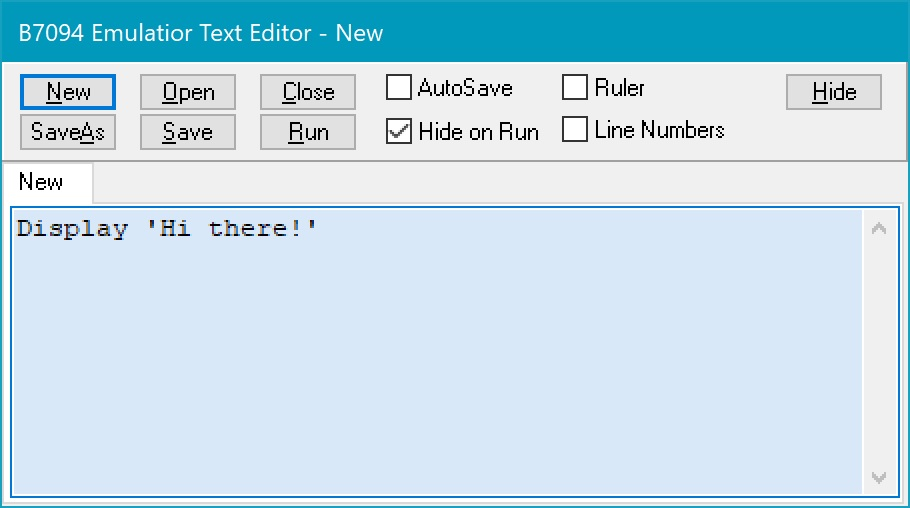

Now click the 'Run' button, and voilà:

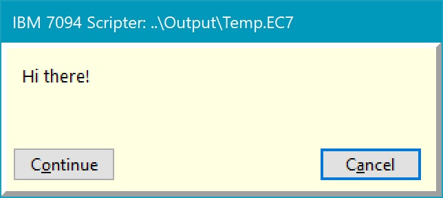

Click either the 'Continue' or the 'Cancel' button, and the 'B7094 Scripter' window will close, the script will end, and the Editor window will re-open (in the former case, because there's no more script to Continue; in the latter case, continuation of a longer script would be Cancelled at that point):

When you clicked 'Run', the Editor automatically created a temporary file ..\Output\Temp.EC7 containing the text that you typed, and ran the Scripter from that file. The box turned green, and the label on the tab changed to 'Temp.EC7'. The color change indicates there's an active file associated with the text box, and will also occur if you 'Save' (to the temp file) or 'SaveAs' (to a "real" file), and the tab label will always reflect that name of the active file. If you 'Open' (any file), the box starts out green, and the tab label contains the name of the file you opened.

You can continue to make changes in your script and 'Run' them, and those changes will automatically be saved to ..\Output\Temp.EC7 and run from there each time. If you click 'Close' in a 'Temp.EC7'-labelled Editor text box, you'll be prompted to save your text as a "real" file, as if you'd clicked 'SaveAs'. You can also click 'SaveAs' it yourself at any time, to save your text (EC7 script or whatever) anywhere, under any name you choose.

You can click 'New' multiple times, and get multiple tabbed editing boxes within the same Editor window (only one is visible at a time, when the corresponding tab is selected). When they're first created, the edit boxes will be blue and 'New' (and each will have the focus and a cursor when it first appears); but they'll all start out "pointing" to ..\Output\Temp.EC7 . A box will turn green and its tab label will change to 'Temp.EC7' once the temp file starts being actively used for that particular text box. However, all the 'Temp.EC7'-labelled text boxes will still have entirely separate contents in memory. You can switch between them by clicking on their corresponding tabs (the focus and cursor will follow your selection), and 'Run' the scripts in them freely. But here's the catch: if you want to **keep** the contents of one or more of the multiple 'Temp.EC7'-labelled text boxes, you must save them to "real" files (named something other than ..\Output\Temp.EC7) before you 'Close' them or 'Power Off' the emulator (and you will be prompted to do so for each 'Temp.EC7'-labelled text box if you 'Close' the box or 'Power Off' the emulator if you haven't already done a 'SaveAs' for that box yourself). You can also 'Open' "real" files to have them simultaneously open in multiple edit boxes.

Any "real" files that you saved text to before you clicked 'Power Off' will be listed in the ..\Bin\B7094.INI file (as well as the tab position of the file you were viewing when you exited the emulator), and they'll be re-loaded the next time you launch the emulator. (Except that if you had unsaved Temp.EC7 text boxes, those won't be listed in the INI file, and the tab index will then default to 1; also, it's OK if some or all of the files listed in the INI file as being edited have gone away in the meantime, and in that case the tab index will also default to 1.) And that's basically all there is to the Editor.

The EC7 scripting language is another story. Probably the best way to get a grip on that would be to examine the existing scripts in the ..\Files\Scripts directory. Most of what you'll want to do will be in there somewhere. But there's also a manual, ..\Docs\B7094ScripterSyntax.txt that gives a full description of the language (admittedly, in somewhat opaque "formal syntax" style). Here's a sequence of commands from one of the more difficult-to-parse entries in the Syntax manual, and its result:

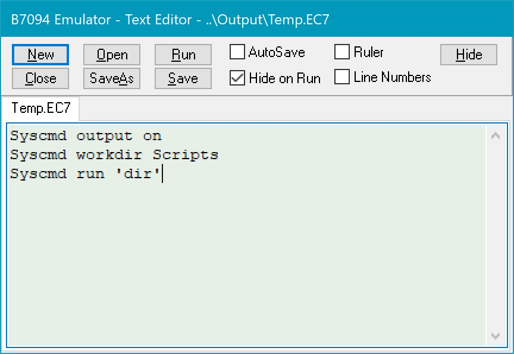

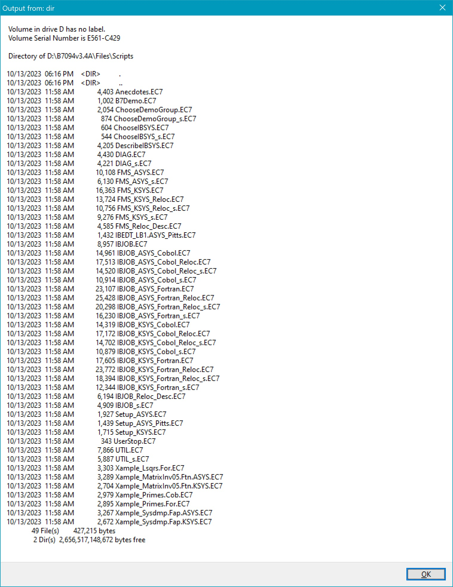

## Totally manual operation

You can also, if you wish, "rough it" by eschewing the Editor, the Scripter, and the canned demos altogether and operating B7094 as if you were sitting in the midst of a machine room with a physical mainframe. You would do this by means of the buttons on the Console window and the various other windows representing the attached peripheral devices.

Here's a step-by-step example of loading and running a program (the 9M21A diagnostic) via manual operation of the emulated card reader. This is a completely stand-alone program which does not involve configuring the system for or loading the IBSYS monitor.

(1) Start the emulator, and in the first demo window click 'End Demonstration Script'. (You know by now that you can turn off the bothersome demos by disabling them on the Configuration window, right?)

(2) In the Control Panel window, click the checkboxes for 'Reader' and 'Printer' to bring up the corresponding windows.

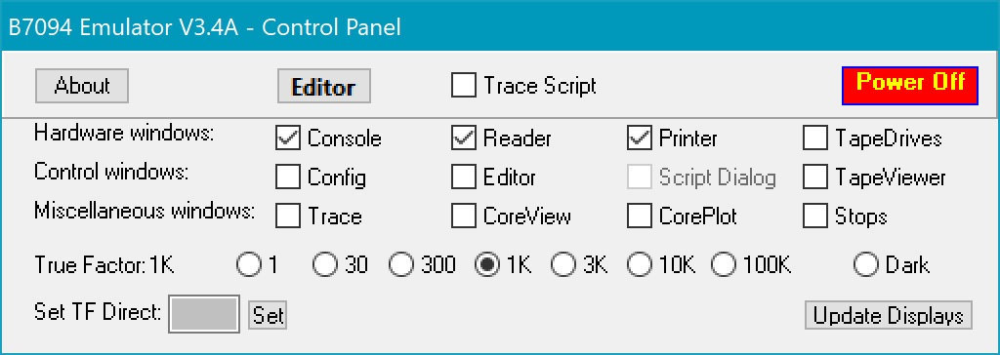

(3) In the 'IBM 711 Card Reader' window, click the 'Open' button and navigate to ..\Files\Cards. On the 'Open file' dialog window, select either 'Any file (*.*)' or 'Column Binary card files (*.CBN)' in the drop-down box to the right of the 'File name:' field. Double-click, or click and 'Open', "9M21A.CBN". The cards will appear in the Card Reader window and the file name will appear in the Card Reader window's title bar. (The column-binary data is not human-readable, except for the sequence numbers in the final eight columns of each card.)

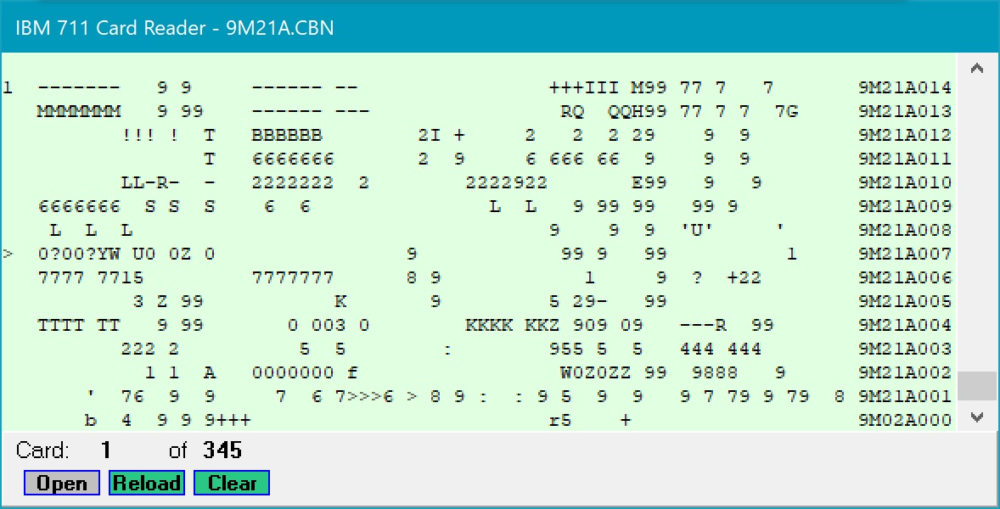

(4) At the bottom right of the Console window, in the row of buttons labelled 'Switches:', click the button corresponding to Switch 6. The label of the button will change from 'off' to 'ON', and its color will change from grey to purple.

(5) At the top of the Console window, click the lavender button labelled 'Load Card'.

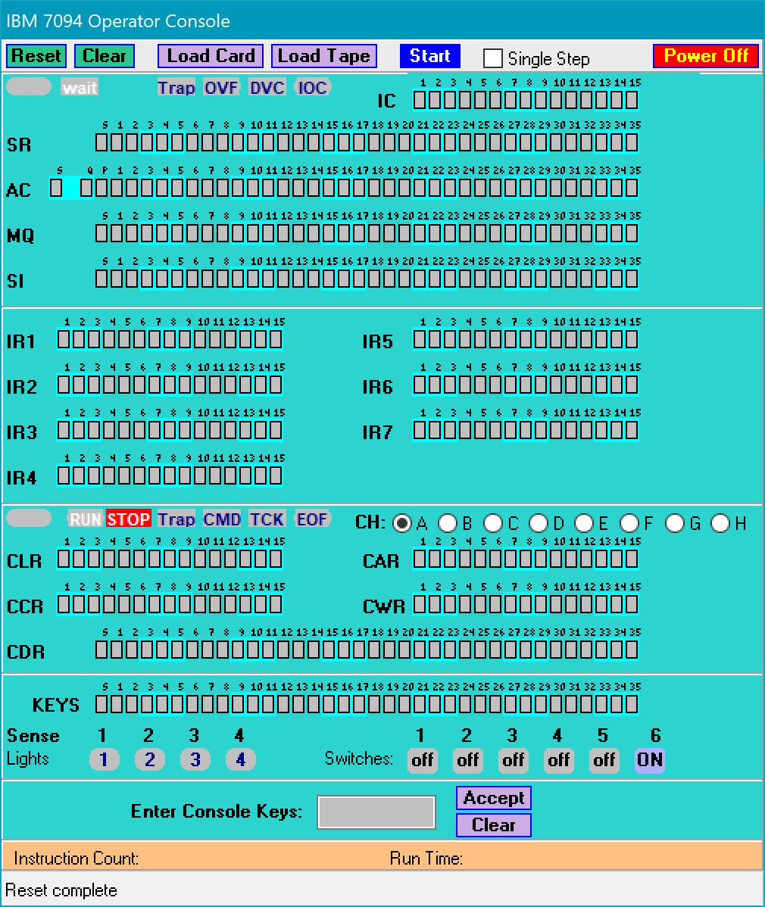

(6) Now watch the 'IBM 716 Line Printer' window. First, the message 'NOW PERFORMING DIAGNOSTIC 9M21' will appear. Then, after a moment, additional lines will appear announcing "100 PROGRAM PASSES COMPLETE 9M21", like so:

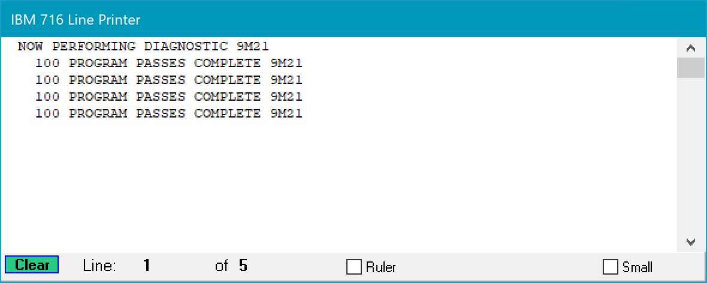

(7) The program will continue running until the CPU is stopped by clicking 'Stop' at the top of the Console window.

After you've stopped the CPU, here's how you can reset things and re-run the same program (similar steps could be taken to run a different program).

(1) Click 'Clear' on the Line Printer window to delete the text there.

(2) Click 'Reload' on the Card Reader window to reload the last card file you loaded, or click 'Open' to reload either the same or load a new file.

(3) Click 'Clear' on the Console window. This both clears (zeroes-out) core memory **and** resets the CPU (whereas 'Reset' just resets the CPU without clearing memory). The emulator's 'Reset' is actually the equivalent of the power-off/power-on cycle of a physical machine, which would have left the contents of non-volatile core memory intact.

(4) Select the required 'off'/'ON' states of the Switches (re-select Switch 6 to re-run 9M21A). On a physical machine, the physical switches would stay put unless toggled manually; our 'Reset' turns them all back to 'off' as a convenience and a safety precaution.)

(6) Once again, click the lavender 'Load Card' button to start the program running.

The following Scripter commands will re-run the above example:

####
    Press Clear
    Load Reader File='9M21A.CBN'
    Set SenSw 6 ON
    Press LoadCard

You can bring up the Editor and copy-and-paste the above commands into a 'New' edit box and then click 'Run' to try them out. Scripter commands are case-insensitve; the capitalization above is strictly a matter of personal preference. Also, the '=' in a script is generally optional; it's there to improve readability but is otherwise ignored. Note that we cannot stop the CPU via the Scripter; the 'Press LoadCard' command will not return until the CPU stops on its own (or is manually stopped by clicking the Console's 'Stop' button, as above).

Here's another example, this time showing how to load and run the tape-based 9M71B diagnostic via manual operation of an emulated tape drive, and also showing how to perform Console Keys entry on the Console window.

(1) Start the emulator, and click 'End Demonstration Script'.

(2) In the Control Panel window, click the checkboxes for 'TapeDrives' and 'Printer'.

(3) On the 'IBM 729 Tape Drives' window, click 'Add Drive' (this automatically selects the 'Show All' radiobutton).

(4) In the newly-visible Tape Unit panel, click the 'Opn' button, and navigate to ..\Files\Tapes. Open tape image file "9M71B.BIN". The name of the image file will appear next to its channel-letter+decimal-unit-number=device-address identifier. The 'Size:' of the image will also be displayed.

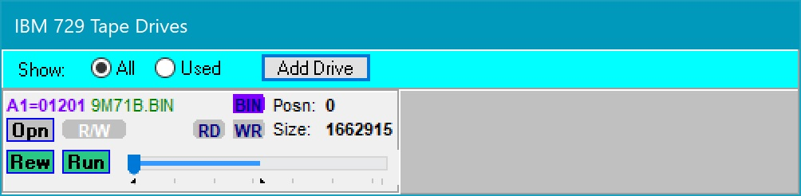

(5) On the Console window, click the button for  Switch 6, turning it 'ON'.

(6) On the Console window, type the octal number "300017" into the text box labelled "Enter Console Keys', and then click the 'Accept' button. You will see the 'KEYS' register light up, like so:

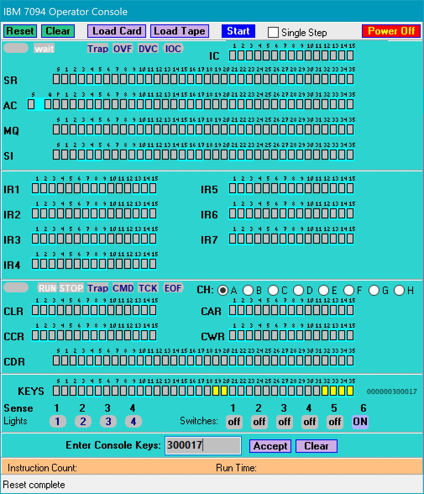

(7) At the top of the Console window, click the lavender button labelled 'Load Tape'.

(8) Now watch the 'IBM 716 Line Printer' window. You should see the following appear:

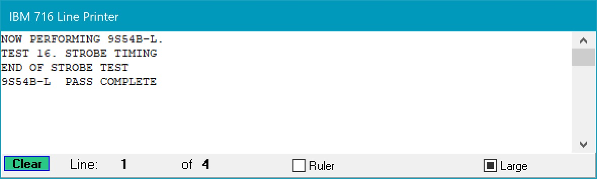

Again, the following Scripter commands will re-run the above example:

####
    Config Del All
    Config Add Tape=A1
    Mount Tape=A1 File='9M71B.BIN'
    Press Clear
    Set SenSw 6 ON
    Enter Keys=300017
    Press LoadTape

This time, the CPU stops on its own, the script ends, and the Editor window reappears.

Finally, we'll have a little light show, exercising all 7 of the index registers in succession, until you get tired and click 'Stop' on the Console window.

(1) At the top of the Console window, click the green 'Clear' button. This clears core and resets the CPU (and also turns 'off' all the switches and clears the Console Keys register).

(2) On the Console window, click the buttons for  Switches 2, 3, 4 and 5, turning them all 'ON'.

(3) In the Tape Unit panel for the 'A1' drive you added above, click the 'Rew' button to rewind the loaded tape image (it's still 9M71B.BIN).

(4) Once again, click the lavender 'Load Tape' button to start the program running.

(5) This time, the program halts the CPU with the IC (instruction counter) at 2.  Click 'Start' to continue the program.

Once more, the Scripter equivalent:

####
    Config Del All
    Config Add Tape=A1
    Mount Tape=A1 File='9M71B.BIN'
    Press Clear
    Set SenSw 2 ON
    Set SenSw 3 ON
    Set SenSw 4 ON
    Set SenSw 5 ON
    Press LoadTape
    Press Start

Enjoy the show! When you get tired of it, either 'Power Off' the emulator or just click the 'Stop' button on the Console window to halt the CPU. You can then continue to use the emulator however you like.

You could even alternate between executing commands via the Editor and Scripter, and pushing buttons on windows to operate the emulated machine manually. The following is a trivial example, but it makes the point.

(1) Start the emulator, 'End Demonstration Script', and in the Control Panel check Reader, Printer, and TapeDrives. Also check Editor, or click the 'Editor' button.

(2) On the Tape Drives window, click the 'All' radiobutton.

(3) In the Editor, click 'New', copy and paste the following commands, and click 'Run'.

####
    Config Add Tape=A2
    Config Add Tape=A3
    TextLoad Clear
    TextLoad End
    TextLoad Save BCD File='SysIn.BCD'
    Mount Tape=A2 File='&OutputPath\SysIn.BCD'
    TextLoad Save BCD File='SysOut.BCD'
    Mount Tape=A3 File='&OutputPath\SysOut.BCD'
    Config Add Tape=B3
    Set Boot=B3

(4) On the Tape Drives window, in the Tape Unit panel for B3, click the 'Opn' button, and navigate to ..\Files\Tapes. Open tape image file "KSYS61.BIN".

(5) On the Console window, click 'Load Tape'.

(6) Check the Line Printer window. You should see:

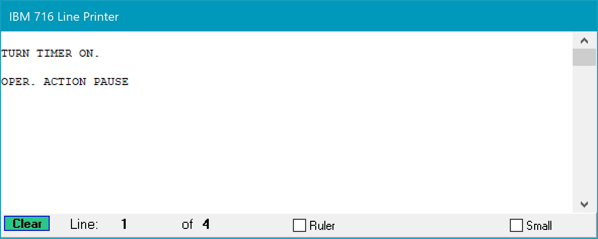

(7) On the Console window, click 'Start'.

(8) Now the Line Printer window will show:

(9) Now copy and paste the following commands into the Editor window (replacing the text already there), and click 'Run' again.

####
    TextLoad Clear
    '$UNITS'
    '$STOP'
    '~'
    TextLoad Reader

(10) Now the Card Reader window will show:

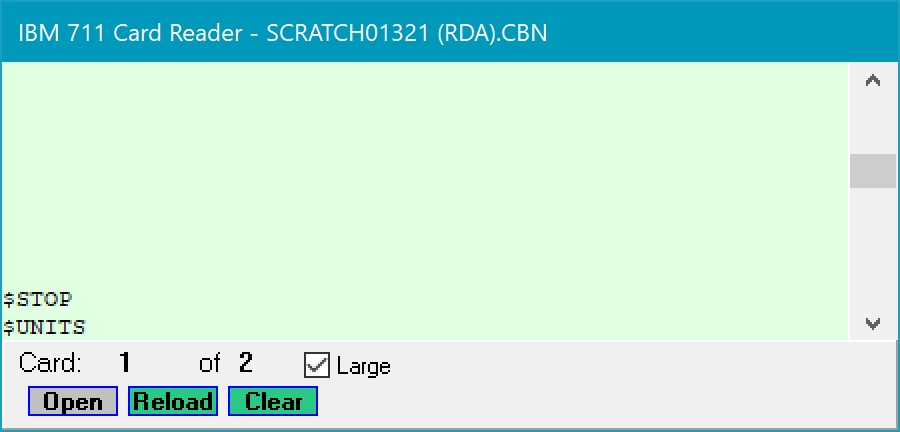

(11) On the Console window, click 'Start' again.

(12) Finally, the Line Printer windows will show:

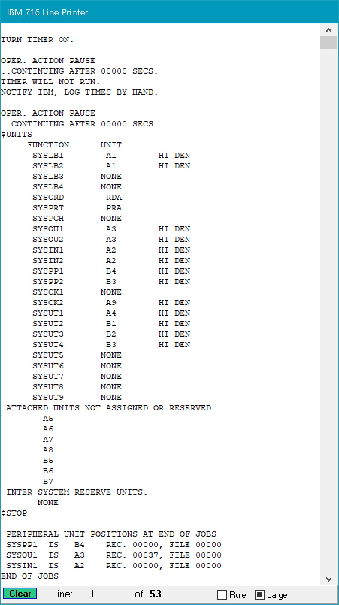

**Note:** The above style of totally (or partially) manual operation works best with simple stand-alone programs such as the card diagnostic and tape diagnostic programs demonstrated here. For programs requiring a more complicated configuration and setup of the system (such as adding tape drives or assembling jobs) it quickly becomes cumbersome **not** to be using the Scripter. IBSYS itself probably falls into the "too cumbersome to run manually" category.

The emulator is fairly robust. If you do something silly, like clicking 'Drop All Drives' while the CPU is operating, you'll get a message "CPU/Channel Check exists. Continue running script?". Just click 'No' at that point (you really have no other choice), then click either 'Reset' or 'Clear' on the Console window to clear the CPU error. You can then bring up the Editor, Open and 'Run' B7Demo.EC7 (or any other script file), and you'll be back in business.

## Acknowledgments

Grateful acknowledgment is due to Richard Cornwell for providing some of the sample demo jobs, and for providing technical assistance in getting this new release operational. And of course to Al Kossow et al. for the bitsavers archive, without which many retro-emulators couldn't exist; to Bob Supnik, Dave Pitts, and Richard Cornwell for their work getting **really**-working IBM 709x emulators operational in the mid-late 2000s.  And to Paul Pierce, who got the ball rolling with his collection of tapes, without which there would be nothing to run on such emulators (well, apart from the CTSS software from MIT).

## Gotchas

Screen "real estate" and the large number of display windows:

- Initial window positions are read from the ..\Bin\B7094.INI file when the emulator starts up, and saved back to B7094.INI when the emulator shuts down (thus recording a changed window position if any window is moved while the emulator is running).  It is possible, for certain monitors, that a window might end up being "out of sight" for a given INI file.  In that case, you'd have to edit the INI file manually to bring the "lost" window back within range.

- There's no way to avoid a "cramped" window layout with a single monitor, with windows potentially obscuring other windows.  A partial remedy for this is that it's possible, from the Control Panel, to de-select (and re-select) windows for display by checking and unchecking the 12 checkboxes
corresponding to the windows.  For the canned demos, the script files normally control when windows are displayed and hidden -- for example, by bringing up the Tape Viewer when a job completes, and then automatically hiding it when you click 'Continue' (on the Scripter window that says
"Click 'Continue' to dismiss the tape viewer and redisplay the demo list.") But if you wanted, for example, to see the whole Operator Console window at the point when a job completes, you could de-select both the Tape Viewer and the Script Dialog windows.  Then you could re-select one (or both) of those windows and click 'Continue' on the Scripter window to resume the demo suite.

There are some things that can make the emulator seem to hang, but are just **very** slow:

- When the Tape Viewer is being displayed after finishing a job with a **lot** of output. (You'll encounter this when building 'STRESS III' from source. Be patient.)

- When you switch the Tape Viewer from BCD mode to BIN mode, when there's a lot of data on the tape.

- When you use the Tape Viewer on a system tape (KSYS61.BIN, for example). Especially if you load the system tape into the Tape Viewer in BCD mode and then realize you actually wanted BIN mode. You'll have to wait a while!

- When you're using B7094's tracing facilities. There are lots of things that can be traced: device accesses, register stores, core writes, instruction execution, etc.  These are all selected on the Log/Trace screen (that you can display by clicking the 'Trace' checkbox on the Control Panel window). But be careful how you use this, if you don't want to slow things down unacceptably (either during the running of a program in the emulator or while waiting for the results of an already-recorded list of traced events to be displayed in the Log/Trace window).  The most efficient way to use this is, in the Log/Trace window, to:

  (1) Check the boxes in the 'Trace Record filters' section on the left to select the classes of items you want traced (the fewer the "better", if you can narrow things down);

  (2) When the job finishes either 'Power Off' the emulator or click the 'Clear' button in the Log/Trace window.  You'll then be prompted to 'Save current trace data?'. Click 'Yes' and a file ..\Output\B7094.TRC will be written (overwriting one that's already there, if there is one). The saving of the trace file can itself take a **bit** of time.

  But the Log/Trace window also has a 'Trace Display filters' section on the right, and this allows you to filter and display in the window anything that's been recorded as a result of making the selections on the left (you check the desired checkboxes on the right, and then click the 'Display' button). But this can be a big annoyance if there's a lot of trace data to be filtered for display (examine the 'Lines:' counter above the 'Display' button to see if this might be the case). This process of filtering for "on-line" display can take a **long** time if there's a lot of trace data -- much longer than just saving all the trace data to a file and then using a text editor to view it.

- If you've activated the Core Plot window. This is a graphical display of core usage, with memory locations represented by blocks of colored pixels. Pixels in a block are black initially; a write to a location turns them blue, a read from a location turns them green, a (pending) instruction fetch flashes a pixel block white (before the actual fetch turns it green). This can be entertaining (and one of the canned demos features it), but it **really** slows down the emulator.

B7094 is a multi-threaded, event-driven application, and sometimes (hopefully not too often) things can jam up. For example, if you start the application and then click 'Power Off' before the Splash window has a chance to close on its own, the application will freeze. In this case, if you just click 'Close' on the Splash window (ignoring the spinning mouse pointer), B7094 will then terminate.

By the way, if you **are** running a demo job and don't want to wait for it to finish, you can click the 'Stop' button on the Operator Console window at any time. The Scripter will treat the job as having completed normally, and both the Tape Viewer window (albeit with truncated contents, of course) and the Script Dialog window that says "Click 'Continue' to dismiss the tape viewer and redisplay the demo list." will come up. Just click 'Continue' at that point, and the demo suite will continue normally. You **could** also, after stopping the CPU in the middle of a job, hide the Tape Viewer and the Script Dialog window (if they happen to be obscuring the Console window) by unchecking them in the Control Panel, then click 'Start' on the Console window and let the job finish! If you then re-display the Tape Viewer and Script Dialog (by checking their boxes again in the Control Panel), they'll be in exactly the same state as when you stopped the CPU. But if you then, on the Tape Drives window, click on the drive letter corresponding to SYSOUT.BCD, the Tape Viewer will be "refreshed" to show the output of the whole job. If you then click 'Continue' on the Script Dialog window, the demo suite will continue normally. You can 'Stop' and 'Start' the CPU as many times as you like!

If the emulator does hang permanently, or if something is just taking more time than you care to wait for, I'm afraid there's nothing for it but to kill the process in the Task Manager.

## Known bugs

- If line numbering is turned on in the Editor window, the numbers in the parallel list box on the left side of the window will not update automatically as text is typed in. But they will be updated if the 'Line Numbers' checkbox is unchecked and then checked again, or if a file is loaded (the latter creates an additional editing box within the same Editor window; multiple text boxes are accessed via the file name tabs near the top of the window).  If text is entered (or loaded from a file) that's long enough to activate the scroll bar for the edit box, a scroll bar for the list box containing the line numbers will also be activated, but the scrolling will not be synchronized.  It will be up to the user to synchronize the line numbers with the text -- such as, by moving both bars to the beginning (or the end), and then scrolling downward (or upward) in discrete steps.

## About the mainframe

The IBM 7094 computer was a commercial 36-bit (6-bit byte) "scientific" computer (with 15-bit addresses, encompassing 32K words) that was produced (beginning as the model 7090; the 7094 was a slightly enhanced version) starting in 1959, and withdrawn from sale in 1969.  While a few installations (e.g., at MIT) remained in service into the 1970s, by the late 60s many customers were switching over to the System/360 series (a 32-bit, 8-bit-byte architecture touted as being "universally" applicable to both commercial and scientific tasks, with a greatly expanded address space).  The 7094 was a member of the "7000 series", which also included commercial machines such as the 7070 and 7074 (architecturally dissimilar to the 7090 and 7094, but sharing manufacturing technology and peripherals) and the quasi-experimental 7030 "STRETCH" supercomputer.  The 7090/7094 was preceded by the vacuum-tube "700 series", an architecturally-similar line of 36-bit machines beginning with the 704 in 1954 (on which both Fortran and Lisp were developed) up through the 709 in 1958).  The machines introduced in 1959 featured IBM's first generation of discrete-transistor circuitry.

While the machine supported random-access storage devices (disk and drum), and some installations utilized these (e.g., MIT's CTSS timesharing system), the more common "IBSYS" operating system made heavy use of magnetic tape and punched cards.

You can read some amusing anecdotes about the IBM 7094 by clicking on the last option of B7094's initial demo window.
